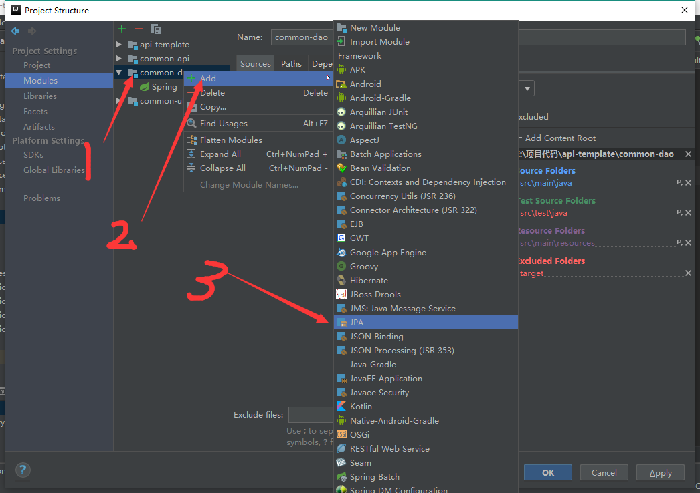
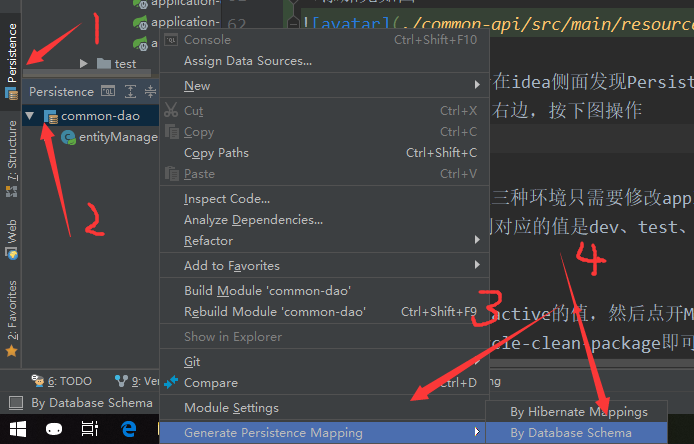
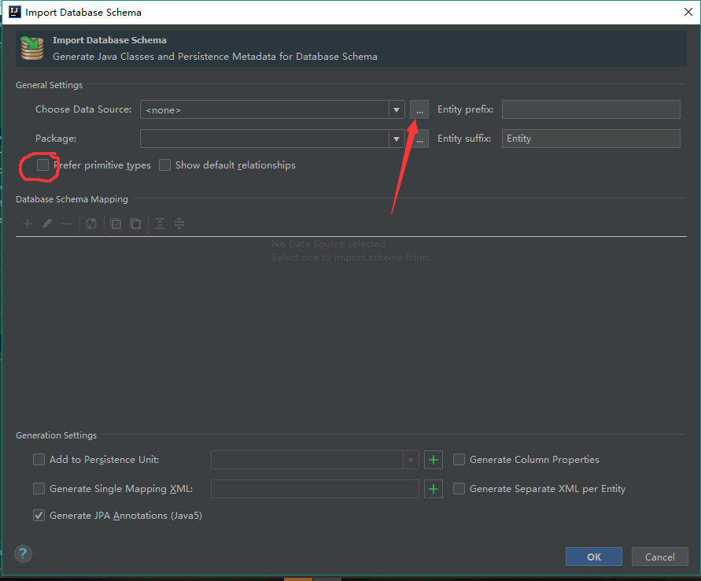
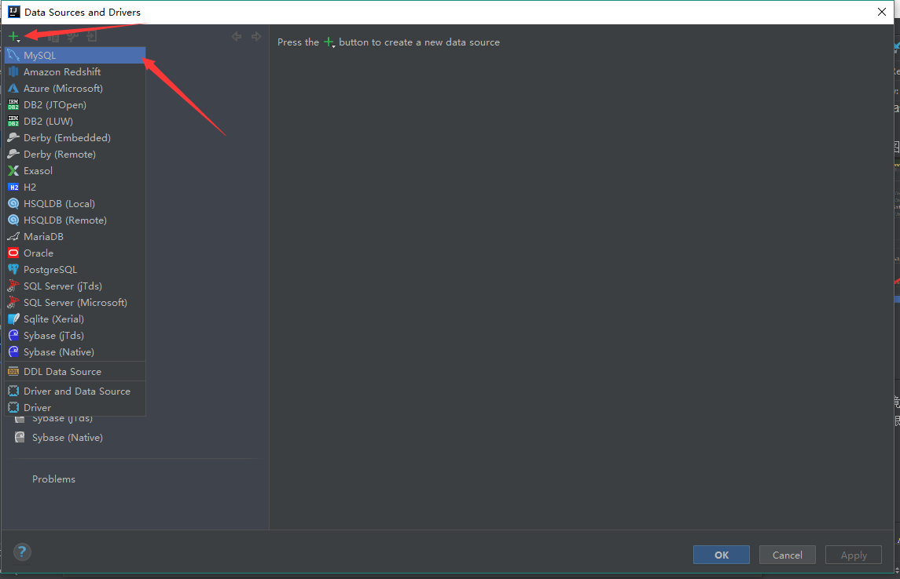
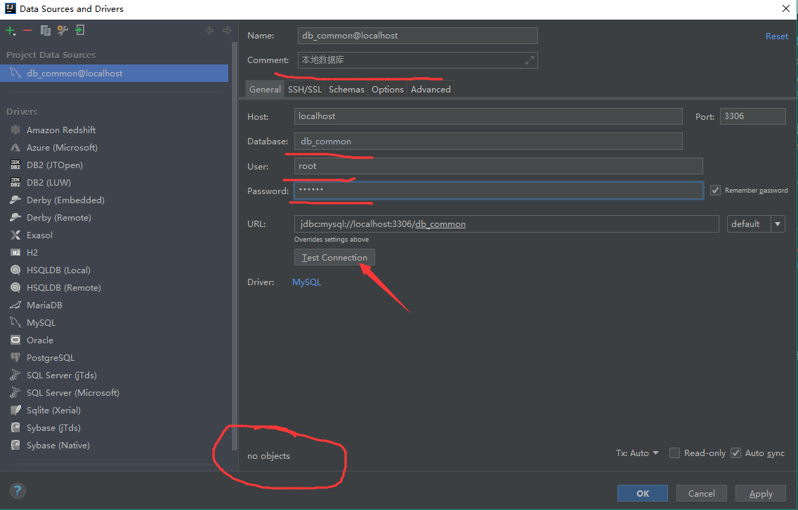
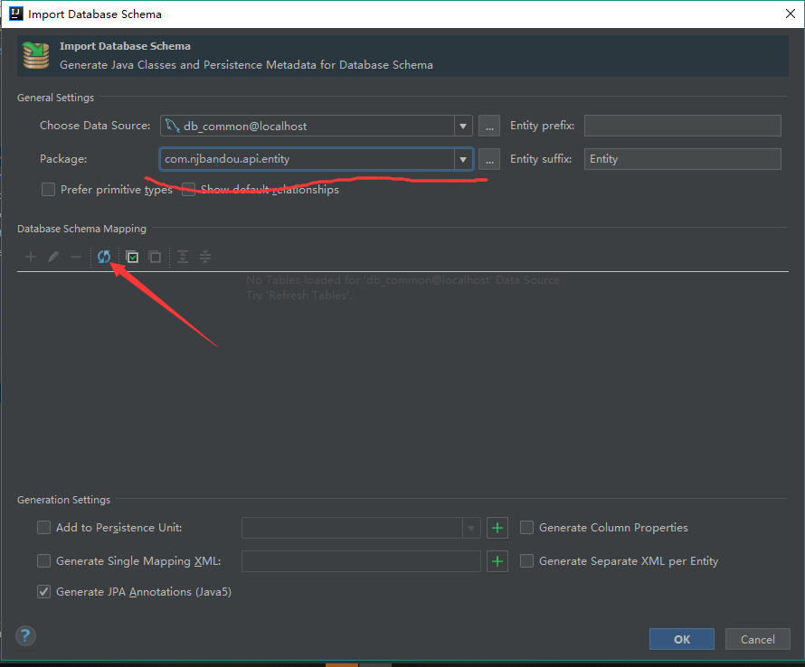
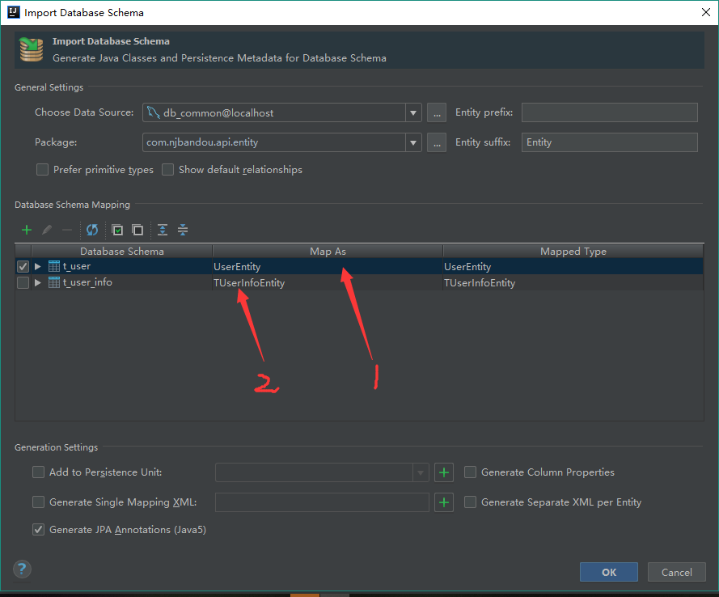
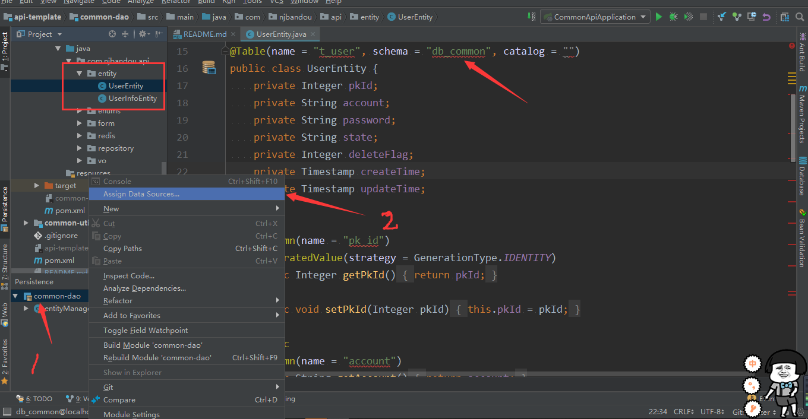
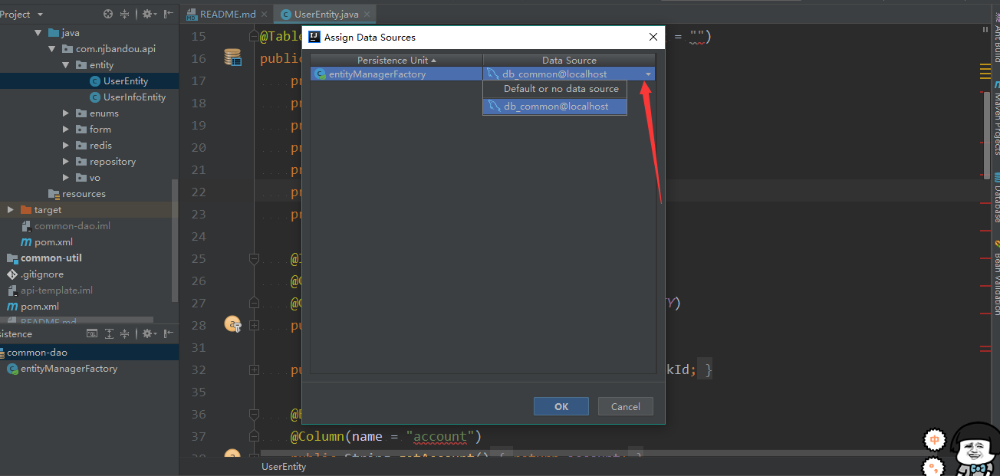

## Template项目目录结构
* api
    * aop文件夹：存放切面配置文件
    * annotation：自定义注解
    * quartz：订时任务
    * config文件夹：存放配置文件
    * controller文件夹：控制层代码；
    * service文件夹：逻辑层代码；
    * interceptor：拦截器文件
    * filter:过滤器
    
* dao
    * redis文件夹：redis相关配置；
    * entity文件夹：由数据库生成的底层实体；
    * enums：枚举类
    * hander:全局异常处理
    * repository文件夹：spring data jpa接口实现文件；
    
* utils
    * result文件夹：数据返回实体；
    * constant文件夹：常量池；
    * 其它默认为某某工具类，这里不做详细介绍；
    
## 底层自动生成
### 教程网址：https://blog.csdn.net/itguangit/article/details/78696797 或 参考 common-api-template
    注意：打开 Persistence窗口 不要勾选 “prefer primitive types(更喜欢原始类型)”；若勾选，生成的实体主键为基本类型，分页查询需要做多余的忽略处理；
    
## 文件描述
application-xxx.yml文件介绍：
- application.yml 基础配置文件
- application-dev.yml 本地测试环境
- application-test.yml 测试服环境
- application-pro.yml 正式服环境
- log 日志
   -- logback.xml  日志文件

# 运行
本地、正式服、测试服三种环境只需要修改application.yml文件
中的active即可。分别对应的值是dev、test、pro

# 打包
和运行一样，需要修改active的值，然后点开MavenProject，
api-template-Lifecycle-clean-package即可

# 构建热部署
当我们修改了java类后，IDEA默认是不自动编译的，而spring-boot-devtools又是监测classpath下的文件发生变化才会重启应用，所以需要设置IDEA的自动编译：

（1）File-Settings-Build-Compiler-Build Project automatically

（2）ctrl + shift + alt + /,选择Registry,勾上 Compiler autoMake allow when app running


# 参数修改
### 修改项目配置
- 打开api模块的application-xxx.yml文件，配置相关的数据库连接参数，
如果要添加公共的配置，应该在application.yml文件添加，不要重复写。

### 修改拦截器

本模板带有自定义登录拦截，接口默认进行登录校验，如果接口是
需要登录就能访问的，需要加上@Authorization注解。

### 修改日志打印文件
- 将HttpAspect中的切点改为自己项目的切点
- 打开api模块，进入resources/log文件夹，打开logback-spring.xml文件，
修改dev环境中的，`<logger name="com.njbandou.api" level="debug"/>`中的name为
自己的包名。

### 修改redis存储数据的key值

打开dao模块，进入redis包，将XxxRedisDao中的redis存储的key值进行修改，
具体修改根据自己的项目结构。

# 底层文件生成
#### ctrl + shift + alt + s打开面板，选中底层所在模块，添加jpa


#### 上一步完成以后，会在idea侧面发现Persistence字样的功能项，可能在左边，也可能在右边，按下图操作


#### 进入页面后按下图或下拉选择已有数据源
## 画圈的地方是一个坑，有勾一定要去掉，不然你可能会在编码过程中引起你极度的不适


#### 添加数据源的操作如下(添加完可以点箭头部分来测试，第一次配置可能画圈部分会有download字样，点击下载即可)



#### 保存完后进入原页面，此时选择实体存放位置，如果没有表显示，就按图点击刷新按钮将表刷新出来


#### 刷新出来的效果如图，勾选要生成的表，点击生成即可(表名前面可能带有T前缀，去掉即可)



#### 此时实体已经生成完毕，但是可能会和下图一样有很多的红色波浪线，按下图步骤1和步骤2和第二张图指定数据库即可




# QueryDSL说明
详细说明可以到[QueryDSL文档](http://www.querydsl.com/static/querydsl/latest/reference/html/)
或者自行百度查看。
这个主要是为了解决JPA连表以及多条件查询各种恶心而出现的一个框架，单表或简单查询直接用spring boot JPA自带
的方法即可。以下是集成步骤：

## 基本用法

- maven坐标

```xml
<!--queryDSL start-->
<dependency>
    <groupId>com.querydsl</groupId>
    <artifactId>querydsl-jpa</artifactId>
</dependency>
<dependency>
    <groupId>com.querydsl</groupId>
    <artifactId>querydsl-apt</artifactId>
    <scope>provided</scope>
</dependency>
<dependency>
    <groupId>javax.inject</groupId>
    <artifactId>javax.inject</artifactId>
    <version>1</version>
</dependency>
<!--queryDSL end-->
```

- pom.xml配置

因为QueryDSL框架需要使用插件为我们配置自动扫描@Entity注解的实体自动创建对应QBean来作为查询时的条件以及自动生成QPath，
所以这里要加一下QueryDSL插件的配置。
这里要注意的是，如果是分模块的项目，需要把这个配置放在dao所在的模块，并且删除掉第一个plugin，并且上面的maven依赖也要
放在同一个模块下，如果是单模块项目则无所谓。初次使用或者添加新表需要compile一下，compile操作之后，对应模块的target/generated-sources/java
下有文件即为配置成功。

```xml
<build>
    <plugins>
        <plugin>
            <groupId>org.springframework.boot</groupId>
            <artifactId>spring-boot-maven-plugin</artifactId>
        </plugin>
        <!--添加QueryDSL插件支持-->
        <plugin>
            <groupId>com.mysema.maven</groupId>
            <artifactId>apt-maven-plugin</artifactId>
            <version>1.1.3</version>
            <executions>
                <execution>
                    <goals>
                        <goal>process</goal>
                    </goals>
                    <configuration>
                        <outputDirectory>target/generated-sources/java</outputDirectory>
                        <processor>com.querydsl.apt.jpa.JPAAnnotationProcessor</processor>
                    </configuration>
                </execution>
            </executions>
        </plugin>
    </plugins>
</build>
```

- 创建基类

在repository下创建基类BaseRepository接口。(接口中的Integer根据主键类型自行替换)

```java
package com.njbandou.api.repository;

import org.springframework.data.jpa.repository.JpaRepository;
import org.springframework.data.jpa.repository.JpaSpecificationExecutor;
import org.springframework.data.querydsl.QuerydslPredicateExecutor;
import org.springframework.data.repository.NoRepositoryBean;

/**
 * @author D丶Cheng
 * @Created with IntelliJ IDEA.
 * @date: 2018/11/19
 * @time: 15:10
 * @Description:
 */
@NoRepositoryBean
public interface BaseRepository<T>
        extends JpaRepository<T,Integer>,
        JpaSpecificationExecutor<T>,
        QuerydslPredicateExecutor<T> {
}
```

- 要使用QueryDSL的repository类继承它即可


```java
/**
 * @author D丶Cheng
 * @Created with IntelliJ IDEA.
 * @date: 2018/10/23
 * @time: 9:50
 * @Description:
 */
public interface UserRepository extends BaseRepository<UserEntity> {
    /*** 自定义方法XXX ***/
    ....
}
```

- 使用
这个直接查看demo中UserServiceImpl中被注释掉的testQueryMoreThenOneTable方法即可，推荐下面的方法。

## 数据库底层代码从抽取到dao层

- 自定义dao及其实现类，详见repository/custom包下代码

`User.dao`

```java
public interface UserDao {

    QueryResults<UserInfoResultVO> testQueryMoreThenOneTable(UserForm userForm);
}
```

`UserDaoImpl.java`(这里不要忘记加注解)

```java
@Repository
public class UserDaoImpl implements UserDao {

    @Autowired
    private EntityManager entityManager;

    /**
     * 查询工厂实体
     */
    private JPAQueryFactory queryFactory;

    //实例化控制器完成后执行该方法实例化JPAQueryFactory
    @PostConstruct
    public void initFactory() {
        queryFactory = new JPAQueryFactory(entityManager);
    }


    @Override
    public QueryResults<UserInfoResultVO> testQueryMoreThenOneTable(UserForm userForm) {
        //用户查询实体
        QUserEntity qUser = QUserEntity.userEntity;
        //用户信息查询实体
        QUserInfoEntity qUserInfo = QUserInfoEntity.userInfoEntity;
        return queryFactory
                .select(
                        Projections.bean(
                                UserInfoResultVO.class,
                                qUser.pkId,
                                qUser.account,
                                qUser.state,
                                qUserInfo.avatar,
                                qUserInfo.nickname,
                                qUser.createTime
                        )
                )
                .from(qUser, qUserInfo)
                .where(
                        //为两个实体关联查询
                        qUser.pkId.eq(qUserInfo.userId)
                                .and(qUserInfo.nickname.like(userForm.getNickname() + "%"))
                                .and(qUser.state.eq(userForm.getState()))
                                .and(qUserInfo.sexual.eq(userForm.getSexual()))
                )
                //根据排序字段倒序
                .orderBy(qUser.pkId.desc())
                .offset(userForm.getPageNum() * userForm.getPageSize())
                .limit(userForm.getPageSize())
                //执行查询
                .fetchResults();
    }
}
```

- 继承自定义dao

`UserRepository`要使用QueryDSL的Repository需要继承自定义dao

```java
public interface UserRepository extends BaseRepository<UserEntity>,UserDao {
    //这里可以什么都不用写，因为已经继承了dao中的方法
    ....
}
```

- 使用
在service层直接调用即可(这样service层就显得更加清晰了)

```java
@Service
public class UserServiceImpl implements UserService {

    @Autowired
    private UserRepository userRepository;
    @Override
    public RestResult testQueryMoreThenOneTable(UserForm userForm) {
        //自定义返回对象
        //QueryResults<T> 中返回的分页数据和JPA自带的有一些不同，具体要根据项目需求，自己做调整，
        // 这里的列表返回值转化仅作为参考，具体根据项目自行调整
        QueryResults<UserInfoResultVO> queryResults = userRepository.testQueryMoreThenOneTable(userForm);
        BaseResultVO<UserInfoResultVO> baseResultVO = new BaseResultVO<UserInfoResultVO>();
        return new RestResultBuilder<>().setData(baseResultVO.formatQueryResults(queryResults, userForm.getPageSize())).build();
    }
}
```

# 运行
本地、正式服、测试服三种环境只需要修改application.yml文件
中的active即可。分别对应的值是dev、test、pro

# 打包
和运行一样，需要修改active的值，然后点开MavenProject，
api-template-Lifecycle-clean-package即可


- jpa相关操作自行百度
- sql在api/resources/sql中


